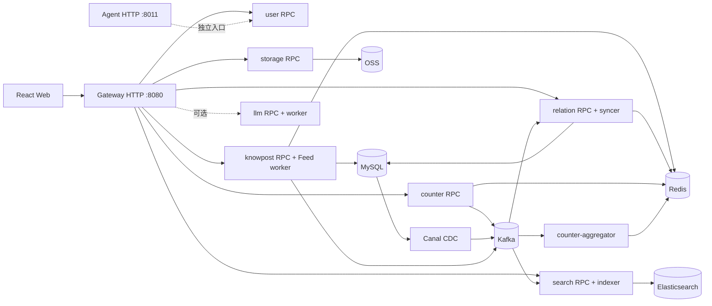

# zhiguang-go：知识社区与个性化 Feed 系统

本项目的初始骨架和核心业务结构来自知光。此后的工作围绕 Go 服务边界、统一网关、个性化 Feed、异步投影、缓存一致性、运行拓扑和可复现压测持续演进；本文以当前仓库中的代码、配置和测试记录为准。

## 项目概览

这是一个包含 Go 后端和 React 前端的知识分享社区。用户可以注册登录、发布知文、关注作者、浏览公开或个性化 Feed、搜索内容，以及点赞和收藏。知文正文通过对象存储直传，搜索索引和部分社交数据由异步事件更新。AI 描述生成、基于内容的问答和个人知识助手是可选能力，不属于默认本地核心栈。

| 能力 | 当前实现 | 主要边界 |
|---|---|---|
| 身份与用户 | 密码/验证码登录、RS256 JWT、资料与关系计数 | `user`、`counter` |
| 内容与媒体 | 草稿、元数据、OSS 预签名直传、内容确认、发布、可见性与删除 | `knowpost`、`storage` |
| 社交与 Feed | 关注/取关、公开 Feed、我的知文、关注流；Push/Pull/Hybrid 策略 | `relation`、`knowpost` |
| 互动与搜索 | 点赞/收藏、计数聚合与校对；Elasticsearch 检索和建议 | `counter`、`search` |
| 智能能力 | 描述生成、RAG 问答；基于收藏内容的独立 Agent | 可选 `llm`、`agent` |
| Web 界面 | 首页、搜索、发布、内容详情、个人资料、登录注册等页面 | `zhiguang_fe-main/` |

## 架构与目录

公共业务 HTTP 统一由 `gateway:8080` 承接，经 gRPC 调用各领域服务；Agent 保留独立的 `:8011` HTTP 入口。内部 RPC 通过 etcd 注册与发现。`deploy/topology/services.json` 是**本地进程、端口、配置和依赖的权威清单**；当前默认本地启动 8 个进程：gateway、user、storage、counter、counter-aggregator、knowpost、relation、search。LLM、Agent 和 outbox 清理不在默认启动集合中。



图中箭头只表达主要依赖，完整进程和配置以 [运行拓扑清单](./deploy/topology/services.json) 为准。默认本地配置使用宿主机 MySQL/Redis；依赖的开发 Compose 均为单机形态，不等同于生产高可用部署。

```text
zhiguang-go/
├── zhiguang_fe-main/       React + TypeScript + Vite 前端
├── services/               gateway 与各业务上下文的进程、用例和适配器
├── proto/                  gRPC 源契约
├── pkg/                   跨上下文基础能力
├── common/                共享业务代码
├── db/migrations/          MySQL 迁移
├── deploy/topology/        本地运行清单与校验器
├── deploy/compose/         开发和容器部署配置
├── cmd/loadtest/           Feed 负载生成、数据集、报告与对比工具
├── scripts/                启停、迁移和代码生成脚本
├── docs/                   设计、运行和历史测试报告
└── var/                    本地二进制、日志、缓存、PID（不入库）
```

业务上下文中的活动实现逐步收敛到 `cmd/<process>`、`internal/application`、`internal/adapter`、`internal/transport` 和 `internal/bootstrap`；`rpc/` 保留跨上下文使用的生成契约与客户端。迁移中的上下文可能仍保留较早的目录形态。新增代码的落点见 [项目结构纲领](./docs/project-structure-guideline.md)。

## 核心设计与取舍

### 1. 短同步链路，异步维护投影

知文发布在 MySQL 事务中同时更新内容与 `outbox`；Canal 订阅 binlog 并送入 Kafka，搜索索引等消费者再更新自己的投影。关注/取关也先写关系事实和 outbox，粉丝反查、Redis 关系列表和相关计数由 `relation-syncer` 后续更新。发布和关注的响应不等待这些下游投影完成，因此读侧可能短暂落后；消费者需要去重、重试以及补偿手段。[核心业务流程](./docs/business-flows.md)记录了四条主要调用链。

这里有一条重要的**当前边界**：发布后 FeedWriter 的收件箱写入、`feed-fanout` 投递仍发生在事务提交后的请求路径，失败仅记录日志，不回滚已发布知文；普通作者的粉丝收件箱由 Kafka worker 批量写入。它尚未与发布事务形成完整的可靠投递闭环，不能把 Feed 投递描述为与 outbox 同等可靠。

### 2. 个性化 Feed 的写扩散与读扩散

Hybrid 策略以作者粉丝量分流：普通作者发帖后异步推送到粉丝 Inbox；超过阈值的作者写入自己的 BigV Outbox，读者请求时再拉取并与 Inbox 归并。仓库也保留纯 Push、纯 Pull 策略供对照。当前阈值是 **1,000 粉丝**，Inbox 和 Outbox 都有容量及 TTL 限制；这些限制节省 Redis 空间，也意味着它们不是无限期的完整历史存档。

读路径已实现版本化 RouteSnapshot、合并 Redis Pipeline、第一页完整 L1/L2 缓存、同 key Singleflight、限额 SWR 刷新，以及 Cursor/seek 深分页。关系 epoch 与内容安全 epoch 用于避免关注变化、删除或转私密后继续返回不可信的缓存页。**这些优化在本地 `knowpost.yaml` 中默认关闭**，压测的 Treatment 预设会明确开启相应开关；性能数字不能直接套用到默认配置。Cursor 保留开关和旧页码接口，翻页期间不提供跨请求快照。[Feed 性能演进指南](./cmd/loadtest/FEED_EVOLUTION_GUIDE.md)列出开关、缓存状态和复现口径。

### 3. 缓存与计数的一致性边界

知文详情和公开 Feed 使用进程内 L1、Redis L2 与数据库回源，并配合失效、TTL 抖动及 Singleflight。MySQL 事务提交到缓存失效之间仍存在短暂不一致窗口；缓存或投影不能当作强一致事实。[缓存一致性说明](./docs/cache-consistency.md)解释了模型缓存与业务缓存的不同失效路径。

点赞/收藏的事实保存在 Redis 位图中，Kafka 事件由 aggregator 合并为对外计数，reconciler 可用位图重新校正计数。这样降低同步写成本，但**Redis 位图不是可随意丢弃的缓存**：当前没有 MySQL 明细作为完整恢复来源，Redis 数据丢失不能靠计数对账自动找回。[可靠性边界](./docs/reliability-mq-cache.md)说明了这类故障与开发环境单点依赖。

### 4. 读写和运行层的可验证性

统一 Gateway 只拥有 HTTP 路由、鉴权和响应映射，业务逻辑仍在领域服务。运行进程由拓扑清单校验，启动脚本按清单构建、检查依赖和端口，停止脚本核对 PID、可执行文件及启动时间。Feed 压测工具保存数据集 manifest、Git/二进制身份、拓扑、策略、缓存状态、依赖指标与逐轮报告；写入场景使用 checkpoint 恢复前态，避免后一个 trial 在前一个 trial 的新帖子上测量。

## 部署与启动

以下命令从仓库根目录执行。Go 版本以 [go.mod](./go.mod) 的 `go` 指令为准；本地前端需要 Node.js/npm，容器方案需要 Docker Compose，数据库迁移脚本需要 `migrate` CLI。示例配置中的数据库口令和 OSS 占位值仅用于本地开发，应按实际环境修改；JWT 需要 `certs/jwt_private.pem` 与 `certs/jwt_public.pem`。LLM/Agent 另需相应模型、向量存储及 API Key。

### Windows：宿主机业务进程

准备运行在 `127.0.0.1:3306` 的 MySQL 和 `127.0.0.1:6379` 的 Redis。`-WithDocker` 仅从完整 Compose 中启动 etcd、ZooKeeper、Kafka、Elasticsearch，其他核心业务进程仍在宿主机；这一模式**不包含 Canal**，因此不适合作为搜索/关系异步投影的完整联调环境。

```powershell
# 首次运行：准备 JWT 密钥和数据库迁移；将示例 DSN、凭据替换为本机配置
New-Item -ItemType Directory -Force certs | Out-Null
openssl genpkey -algorithm RSA -pkeyopt rsa_keygen_bits:2048 -out certs/jwt_private.pem
openssl pkey -in certs/jwt_private.pem -pubout -out certs/jwt_public.pem
.\scripts\migrate.bat up

go run ./deploy/topology/cmd/validate
.\scripts\start-all.ps1 -WithDocker
Invoke-RestMethod http://127.0.0.1:8080/api/v1/counter/knowpost/readme-smoke

# 结束本地业务进程；依赖容器按需单独管理
.\scripts\stop-all.ps1
```

已自行启动所有依赖时，可直接运行 `.\scripts\start-all.ps1`；先看启动计划可加 `-ValidateOnly`。脚本将日志、PID 和二进制写入 `var/log/dev`、`var/run/dev`、`var/bin/dev`。迁移连接由 `ZG_MIGRATE_DSN` 覆盖，默认值写在 [迁移脚本](./scripts/migrate.bat) 中。

### Compose：完整核心业务联调

[开发 Compose](./deploy/compose/docker-compose.dev.yml)使用宿主机 MySQL/Redis，并在容器内运行 etcd、Kafka、Canal、Elasticsearch 和 8 个核心业务进程。先完成迁移，确保 MySQL 开启 binlog、Canal 账号可用，且容器能访问宿主机数据库；Compose 自行初始化容器内 JWT 密钥。不要与上面的本地进程方案同时占用相同端口。

```powershell
.\scripts\migrate.bat up
docker compose -f deploy/compose/docker-compose.dev.yml config
docker compose -f deploy/compose/docker-compose.dev.yml up -d --build --wait --wait-timeout 180
docker compose -f deploy/compose/docker-compose.dev.yml ps
Invoke-RestMethod http://127.0.0.1:8080/api/v1/counter/knowpost/readme-smoke
```

另有 [完整容器编排](./deploy/compose/docker-compose.full.yml)，它包含 MySQL/Redis、LLM 和 Agent 服务；应先检查密钥、环境变量、资源和迁移配置，再用于其他部署环境。仓库内的部署示例是开发/验证起点，不能直接视为已完成多节点容灾的生产方案。

### 前端

```powershell
cd zhiguang_fe-main
npm ci
npm run dev
```

Vite 默认监听 `http://localhost:8888`，将 `/api` 代理到 `http://localhost:8080`。跨源部署时可通过 `VITE_API_BASE_URL` 设置 API 地址。后端主入口为 `/api/v1/*`；可选 Agent 使用独立的 `/api/v1/agent/*` 入口。前端开发代理只指向 Gateway，使用 Agent 时还需单独配置路由或代理。

## 测试效果与性能测试设计

项目的单元/契约测试覆盖服务逻辑、Gateway 路由与鉴权、拓扑、Compose 和前端 API 契约。常用静态检查：

```powershell
go run ./deploy/topology/cmd/validate
go test -buildvcs=false ./...
go vet -buildvcs=false ./...
go build -buildvcs=false ./...
cd zhiguang_fe-main
npm ci
npm run lint
npm test
npm run build
```

性能测试刻意把 **RPC 内核** 与 **Gateway 真实入口** 分开，把 20 / 约 1,200 / 20,000 个读者及 cold、L1 warm、L2 warm 缓存前态分开。正式容量点采用 10 秒预热、60 秒采样、三轮中位数；同时记录 QPS、P95/P99、错误、客户端 CPU、服务 CPU/RSS、Redis、MySQL、Kafka lag 和进程身份。失败、降级、指标缺失、进程重启或客户端饱和的轮次不进入容量结论。读矩阵与会发布知文的写入/混合矩阵分开；后者每轮恢复 manifest 所属的 MySQL/Redis 基线，并等待 Kafka lag 排空和稳定。复现入口见 [读矩阵指南](./cmd/loadtest/FEED_MATRIX_GUIDE.md)与[写入/混合矩阵指南](./cmd/loadtest/FEED_MUTATION_GUIDE.md)。

以下是仓库中**已有报告**的代表性结果，不是本次 README 更新重新跑出的数字，也不是跨环境 SLA：

| 场景与口径 | 结果 | 可以说明什么 |
|---|---|---|
| Hybrid 冷计算，Compose 全栈，约 1,200 读者，RPC c128，60 秒 × 3 | WP2 **2,590 → WP6 10,661 QPS**；P95 **64.34 → 18.11 ms** | RouteSnapshot 与 Combined Pipeline 逐阶段减少关系查询和 Redis 往返；同口径阶段对比 |
| 热点第一页，本地混合拓扑，20 读者，RPC c32，60 秒 × 3 | Control cold **3,029**；Treatment L1 warm **8,222 QPS** | 目标运行态的页面缓存收益；缓存前态不同，不能归因于单个开关 |
| 深分页 page50，静态 1,500 候选集，RPC c16，60 秒 × 3 | 页码 **592**；Cursor **7,622 QPS**；P95 **35.66 → 3.36 ms** | 精确 seek 显著降低深页返回成员与装载成本；Cursor 默认仍关闭 |
| 80/20 读写混合，RPC c4，cold，同 checkpoint，60 秒 × 3 | Control **34.26**；Treatment **30.05 总操作 QPS** | 读优化在高写入比例下没有提高总吞吐，发布 P95 从 **712.67 → 828.74 ms** |

读路径结果与限制见 [Feed 综合性能报告](./docs/superpowers/reports/2026-08-17-feed-hybrid-comprehensive-performance-report.md)，深分页见 [Cursor A/B](./docs/superpowers/reports/2026-08-17-feed-cursor-pagination-ab.md)，写入和混合负载见 [mutation RPC A/B](./docs/superpowers/reports/2026-08-27-feed-wp11-mutation-rpc-ab.md)。2026-07-03 的[公开 Feed 缓存压测](./docs/loadtest-knowpost-feed.md)测的是另一条接口和较早的代码，不能与个性化 Feed 的 QPS 直接比较。

## 优势、限制与下一步

**已有价值**：业务按上下文隔离，HTTP 入口和本地拓扑可核对；Outbox/CDC 将一部分副作用从同步请求移出；Hybrid Feed 用写扩散换普通作者的读成本、用读扩散控制大作者的发帖成本；性能工作保留了数据前态、运行身份和无效轮次，能解释收益发生在哪里。

**当前限制**：默认开发依赖仍是单点；Redis 位图承载互动事实但缺少可重建的持久明细；Feed 发布后的投递仍有 best-effort 窗口；搜索和关系等异步投影尚缺完整的自动对账/重建闭环；`Reindex` RPC 目前只是归属校验 stub。页面缓存、Cursor 等优化默认关闭，高基数读者会碰到缓存复用下降和刷新队列压力；Gateway 与完整发布流程也是独立瓶颈。可选 AI 服务还需外部模型和存储，并未由默认栈验证。

下一阶段优先把 Feed 投递与事实写入接成可重放链路，并为异步投影补齐对账；再验证 Redis/Kafka 多节点故障恢复与数据恢复策略。性能方面应继续拆解完整发布各阶段、按读者局部性和写入比例控制页面缓存准入，并在相同条件下验证优化开关的灰度启用。生产化仍需密钥管理、资源隔离、告警与链路追踪。

## 延伸阅读与来源

- [项目结构与代码生成约定](./docs/project-structure-guideline.md)
- [核心业务流程](./docs/business-flows.md) · [数据库设计](./docs/db-schema-design.md)
- [Feed 压测执行指南](./cmd/loadtest/FEED_EVOLUTION_GUIDE.md) · [完整性能报告](./docs/superpowers/reports/2026-08-17-feed-hybrid-comprehensive-performance-report.md)
- [Agent 设计说明](./services/agent/AGENT-README.md) · [运行拓扑说明](./deploy/topology/README.md)

项目骨架与核心结构源自知光；本文着重呈现此后在服务拆分、Feed、数据一致性、部署拓扑和测试体系上的实现与取舍。
