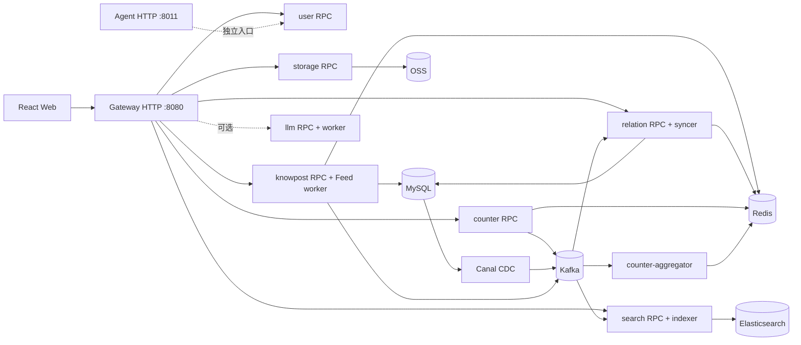

# zhiguang-go：知识社区与个性化 Feed 系统

项目最初的骨架和核心业务结构来自知光。此后，我们逐步完成了 Go 服务拆分、统一网关、个性化 Feed、异步投影、缓存一致性、运行拓扑和压测体系的建设。

## 项目概览

这是一个由 Go 后端和 React 前端组成的知识分享社区。用户可以注册登录、发布知文、关注作者、浏览公开或个性化 Feed、搜索内容，也可以点赞和收藏。知文正文由客户端直传对象存储；搜索索引和部分社交数据在事件消费后更新。AI 描述生成、基于内容的问答和个人知识助手可按需启用，默认本地核心栈不包含这些服务。

| 能力 | 当前实现 | 主要边界 |
|---|---|---|
| 身份与用户 | 密码/验证码登录、RS256 JWT、资料与关系计数 | `user`、`counter` |
| 内容与媒体 | 草稿、元数据、OSS 预签名直传、内容确认、发布、可见性与删除 | `knowpost`、`storage` |
| 社交与 Feed | 关注/取关、公开 Feed、我的知文、关注流；Push/Pull/Hybrid 策略 | `relation`、`knowpost` |
| 互动与搜索 | 点赞/收藏、计数聚合与校对；Elasticsearch 检索和建议 | `counter`、`search` |
| 智能能力 | 描述生成、RAG 问答；基于收藏内容的独立 Agent | 可选 `llm`、`agent` |
| Web 界面 | 首页、搜索、发布、内容详情、个人资料、登录注册等页面 | `zhiguang_fe-main/` |

## 架构与目录

公共业务请求从 `gateway:8080` 进入，再通过 gRPC 调用领域服务。Agent 使用独立的 `:8011` HTTP 入口，内部 RPC 通过 etcd 注册与发现。

本地进程、端口、配置和依赖以 `deploy/topology/services.json` 为准。当前默认启动 8 个进程：gateway、user、storage、counter、counter-aggregator、knowpost、relation、search。LLM、Agent 和 outbox 清理需要另行启动。



图中只画了主要依赖；完整进程和配置见 [运行拓扑清单](./deploy/topology/services.json)。默认本地配置使用宿主机 MySQL/Redis。开发 Compose 的依赖服务均为单机部署，尚未具备多节点容灾能力。

```text
zhiguang-go/
├── zhiguang_fe-main/       React + TypeScript + Vite 前端
├── services/               gateway 与各业务上下文的进程、用例和适配器
├── proto/                  gRPC 源契约
├── pkg/                   跨上下文基础能力
├── common/                共享业务代码
├── db/migrations/          MySQL 迁移
├── deploy/topology/        本地运行清单与校验器
├── deploy/compose/         开发和容器部署配置
├── cmd/loadtest/           Feed 负载生成、数据集、报告与对比工具
├── scripts/                启停、迁移和代码生成脚本
├── docs/                   设计、运行和历史测试报告
└── var/                    本地二进制、日志、缓存、PID（不入库）
```

各业务上下文正在逐步采用相同的目录分工：`cmd/<process>` 是进程入口，`internal/application` 放业务用例，`internal/adapter` 对接外部依赖，`internal/transport` 处理协议，`internal/bootstrap` 负责组装。跨上下文使用的生成契约与客户端留在 `rpc/`。仍在迁移的上下文保留了部分旧目录；新增代码的落点见 [项目结构纲领](./docs/project-structure-guideline.md)。

## 核心设计与取舍

### 事务与异步投影

发布知文时，MySQL 在同一事务中更新内容并写入 `outbox`。Canal 订阅 binlog，将事件送入 Kafka，搜索服务随后更新索引。关注和取关采用相同的事务写入方式；`relation-syncer` 再更新粉丝反查表、Redis 关系列表和相关计数。

发布和关注请求不会等待这些投影更新，短时间内可能读到旧数据。消费端通过去重和重试处理重复投递与暂时性故障，但仍需要补偿机制。[核心业务流程](./docs/business-flows.md)记录了四条主要调用链。

Feed 投递目前走另一条路径。发布事务提交后，FeedWriter 仍在请求路径写入作者收件箱并发送 `feed-fanout`；失败只记日志，已发布的知文不会回滚。Kafka worker 随后批量写入普通作者的粉丝收件箱。这条链路还缺少与发布事务衔接的可靠投递闭环。

### 个性化 Feed

Hybrid 策略根据作者的粉丝数选择投递方式。粉丝不超过 1,000 人时，发帖后异步写入粉丝 Inbox；超过 1,000 人时，帖子写入作者的 BigV Outbox，由读者请求时拉取并与 Inbox 归并。仓库还保留纯 Push 和纯 Pull 策略，便于对照测试。Inbox 和 Outbox 都设置了容量上限与 TTL，以控制 Redis 占用；过期或超出容量的内容不会继续保留在这些列表中。

读路径实现了版本化 RouteSnapshot、合并 Redis Pipeline、第一页完整 L1/L2 缓存、同 key Singleflight、限额 SWR 刷新和 Cursor/seek 深分页。关系 epoch 与内容安全 epoch 控制缓存页的有效性：关注变化、内容删除或转私密后，旧页面不能继续作为可信结果返回。

本地 `knowpost.yaml` 默认关闭这些优化，压测使用 Treatment 预设显式开启相应开关。Cursor 也保留独立开关和旧页码接口，翻页期间不提供跨请求快照。因此，下面的性能数字对应特定配置，不能直接套用到默认栈。[Feed 性能演进指南](./cmd/loadtest/FEED_EVOLUTION_GUIDE.md)列出了开关、缓存状态和复现口径。

### 缓存与计数

知文详情和公开 Feed 先查进程内 L1，再查 Redis L2，最后回源数据库。失效、TTL 抖动和 Singleflight 用来控制旧数据窗口及并发回源压力。MySQL 事务提交后，缓存失效尚未完成的短暂窗口内仍可能读到旧值，缓存和投影均不保证强一致。[缓存一致性说明](./docs/cache-consistency.md)分别说明了模型缓存和业务缓存的处理方式。

点赞和收藏的状态保存在 Redis 位图中。aggregator 消费 Kafka 事件后更新对外计数，reconciler 可根据位图校正计数偏差。这降低了同步写入成本，也使位图成为必须保护的数据：当前没有可用于完整恢复的 MySQL 明细。若位图丢失，计数对账无法找回用户的点赞和收藏状态。[可靠性边界](./docs/reliability-mq-cache.md)还记录了开发环境的单点依赖。

### 运行拓扑与测试证据

Gateway 负责 HTTP 路由、鉴权和响应映射，业务逻辑留在领域服务。启动脚本按拓扑清单构建进程，并检查依赖和端口；停止脚本核对 PID、可执行文件及启动时间后才结束进程。

Feed 压测工具记录数据集 manifest、Git/二进制身份、拓扑、策略、缓存状态、依赖指标和每轮结果。写入场景通过 checkpoint 恢复数据基线，防止后续 trial 读到前一轮新发布的帖子。

## 部署与启动

以下命令均从仓库根目录执行。Go 版本见 [go.mod](./go.mod)；运行前端需要 Node.js/npm，容器部署需要 Docker Compose，数据库迁移脚本依赖 `migrate` CLI。

示例配置中的数据库口令和 OSS 占位值需要按实际环境修改。JWT 使用 `certs/jwt_private.pem` 和 `certs/jwt_public.pem`；LLM/Agent 还需要模型、向量存储及对应的 API Key。

### Windows：宿主机业务进程

先在宿主机启动 MySQL (`127.0.0.1:3306`) 和 Redis (`127.0.0.1:6379`)。`-WithDocker` 从完整 Compose 中启动 etcd、ZooKeeper、Kafka 和 Elasticsearch，核心业务进程仍在宿主机运行。这个启动配置没有 Canal，搜索索引和关系投影的异步更新需要另行准备 Canal 环境。

```powershell
# 首次运行：准备 JWT 密钥和数据库迁移；将示例 DSN、凭据替换为本机配置
New-Item -ItemType Directory -Force certs | Out-Null
openssl genpkey -algorithm RSA -pkeyopt rsa_keygen_bits:2048 -out certs/jwt_private.pem
openssl pkey -in certs/jwt_private.pem -pubout -out certs/jwt_public.pem
.\scripts\migrate.bat up

go run ./deploy/topology/cmd/validate
.\scripts\start-all.ps1 -WithDocker
Invoke-RestMethod http://127.0.0.1:8080/api/v1/counter/knowpost/readme-smoke

# 结束本地业务进程；依赖容器按需单独管理
.\scripts\stop-all.ps1
```

如果依赖服务已启动，直接运行 `.\scripts\start-all.ps1` 即可。加 `-ValidateOnly` 可以先检查启动计划。脚本将日志、PID 和二进制分别写入 `var/log/dev`、`var/run/dev`、`var/bin/dev`。数据库连接可通过 `ZG_MIGRATE_DSN` 覆盖；默认值见 [迁移脚本](./scripts/migrate.bat)。

### Compose：完整核心业务联调

[开发 Compose](./deploy/compose/docker-compose.dev.yml)沿用宿主机 MySQL/Redis，在容器中启动 etcd、Kafka、Canal、Elasticsearch 和 8 个核心业务进程。启动前先完成迁移，确认 MySQL 已开启 binlog、Canal 账号可用，且容器能够访问宿主机数据库。Compose 会初始化容器内的 JWT 密钥。切换到这套配置前，应先停止占用相同端口的本地业务进程。

```powershell
.\scripts\migrate.bat up
docker compose -f deploy/compose/docker-compose.dev.yml config
docker compose -f deploy/compose/docker-compose.dev.yml up -d --build --wait --wait-timeout 180
docker compose -f deploy/compose/docker-compose.dev.yml ps
Invoke-RestMethod http://127.0.0.1:8080/api/v1/counter/knowpost/readme-smoke
```

[完整容器编排](./deploy/compose/docker-compose.full.yml)还包含 MySQL/Redis、LLM 和 Agent 服务。部署到其他环境前，需要检查密钥、环境变量、资源和迁移配置。仓库目前提供的是开发与验证用编排，尚未完成多节点容灾部署。

### 前端

```powershell
cd zhiguang_fe-main
npm ci
npm run dev
```

Vite 默认监听 `http://localhost:8888`，并将 `/api` 代理到 `http://localhost:8080`。跨源部署可通过 `VITE_API_BASE_URL` 指定 API 地址。普通业务使用 `/api/v1/*`，Agent 使用独立的 `/api/v1/agent/*` 入口；前端开发代理只连接 Gateway，因此使用 Agent 时还需单独配置路由或代理。

## 测试效果与性能测试设计

仓库中有服务逻辑、Gateway 路由与鉴权、拓扑、Compose 和前端 API 契约的测试。常用检查命令如下：

```powershell
go run ./deploy/topology/cmd/validate
go test -buildvcs=false ./...
go vet -buildvcs=false ./...
go build -buildvcs=false ./...
cd zhiguang_fe-main
npm ci
npm run lint
npm test
npm run build
```

Feed 压测分别测 RPC 内核和经过 Gateway 的真实请求链路。数据集按 20、约 1,200、20,000 个读者划分，并记录 cold、L1 warm、L2 warm 等缓存前态。正式容量测试每轮预热 10 秒、采样 60 秒，独立运行三轮后取中位数。

报告同时记录 QPS、P95/P99、错误、客户端 CPU、服务 CPU/RSS、Redis、MySQL、Kafka lag 和进程身份。发生失败或降级、缺少指标、进程重启、客户端饱和的轮次不计入容量结论。纯读矩阵与发布/混合矩阵分别运行；写入测试每轮恢复 manifest 所属的 MySQL/Redis 基线，并等待 Kafka lag 排空和稳定。操作步骤见 [读矩阵指南](./cmd/loadtest/FEED_MATRIX_GUIDE.md)和[写入/混合矩阵指南](./cmd/loadtest/FEED_MUTATION_GUIDE.md)。

下表引用仓库已有报告，当前代码版本未重新压测。各项测试的入口、数据集和缓存状态不同，不能合并为统一的容量指标。

| 场景与口径 | 结果 | 可以说明什么 |
|---|---|---|
| Hybrid 冷计算，Compose 全栈，约 1,200 读者，RPC c128，60 秒 × 3 | WP2 2,590 → WP6 10,661 QPS；P95 64.34 → 18.11 ms | RouteSnapshot 与 Combined Pipeline 逐阶段减少关系查询和 Redis 往返；同口径阶段对比 |
| 热点第一页，本地混合拓扑，20 读者，RPC c32，60 秒 × 3 | Control cold 3,029；Treatment L1 warm 8,222 QPS | 目标运行态的页面缓存收益；缓存前态不同，不能归因于单个开关 |
| 深分页 page50，静态 1,500 候选集，RPC c16，60 秒 × 3 | 页码 592；Cursor 7,622 QPS；P95 35.66 → 3.36 ms | 精确 seek 显著降低深页返回成员与装载成本；Cursor 默认仍关闭 |
| 80/20 读写混合，RPC c4，cold，同 checkpoint，60 秒 × 3 | Control 34.26；Treatment 30.05 总操作 QPS | 读优化在高写入比例下没有提高总吞吐，发布 P95 从 712.67 → 828.74 ms |

读路径的完整条件和限制见 [Feed 综合性能报告](./docs/superpowers/reports/2026-08-17-feed-hybrid-comprehensive-performance-report.md)。深分页数据见 [Cursor A/B](./docs/superpowers/reports/2026-08-17-feed-cursor-pagination-ab.md)，写入和混合负载见 [mutation RPC A/B](./docs/superpowers/reports/2026-08-27-feed-wp11-mutation-rpc-ab.md)。2026-07-03 的[公开 Feed 缓存压测](./docs/loadtest-knowpost-feed.md)使用另一条接口和较早的代码，应单独阅读。

## 优势、限制与下一步

业务按上下文隔离，HTTP 入口和本地拓扑可以逐项核对。Outbox/CDC 将搜索索引、关系投影等更新移出同步请求；Hybrid Feed 让普通作者承担写扩散，让大作者在读时归并，从而控制两类流量的成本。性能报告保留数据前态、运行身份和无效轮次，便于追溯每次结果的条件。

目前仍有几处缺口。默认开发依赖是单点；Redis 位图保存互动事实，却没有可供重建的持久明细。Feed 发布后的投递仍有 best-effort 窗口，搜索和关系等异步投影缺少完整的自动对账与重建流程，`Reindex` RPC 目前只做归属校验。

页面缓存和 Cursor 默认关闭；读者基数升高时，缓存复用率下降，刷新队列也可能承压。Gateway 和完整发布流程各有性能瓶颈。可选 AI 服务依赖外部模型和存储，尚未纳入默认栈的验证范围。

下一步需要让 Feed 投递具备可重放能力，并为异步投影补齐对账，再验证 Redis/Kafka 多节点故障恢复和数据恢复策略。性能方面应继续拆解完整发布的各阶段，按读者局部性和写入比例调整页面缓存准入，并在相同条件下验证优化开关的灰度启用。生产部署还需要密钥管理、资源隔离、告警和链路追踪。

## 延伸阅读与来源

- [项目结构与代码生成约定](./docs/project-structure-guideline.md)
- [核心业务流程](./docs/business-flows.md) · [数据库设计](./docs/db-schema-design.md)
- [Feed 压测执行指南](./cmd/loadtest/FEED_EVOLUTION_GUIDE.md) · [完整性能报告](./docs/superpowers/reports/2026-08-17-feed-hybrid-comprehensive-performance-report.md)
- [Agent 设计说明](./services/agent/AGENT-README.md) · [运行拓扑说明](./deploy/topology/README.md)

知光提供了项目最初的骨架和核心业务结构。当前的服务边界、Feed 设计、数据一致性、部署拓扑和压测体系，是此后持续建设的重点。
