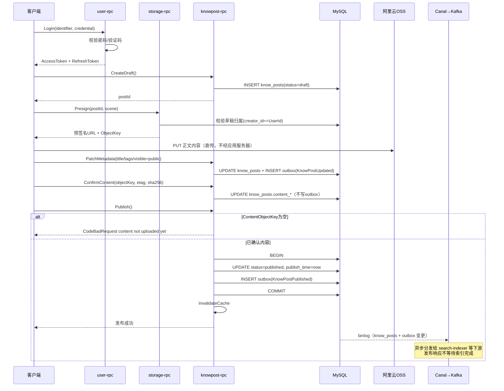
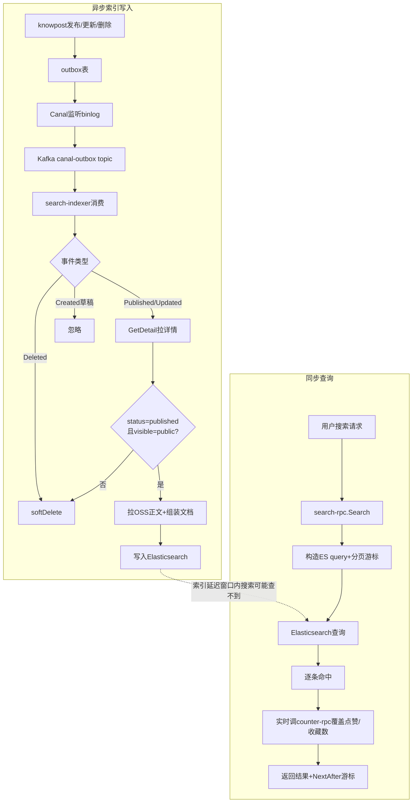
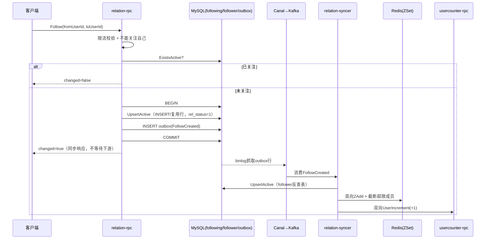
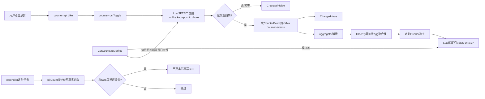

# 核心业务流程

本文档基于源代码实际调用链路（HTTP 路由 → API 层 → RPC 层 → 存储层/消息层）梳理 4 条核心业务流程，重点标注**同步阻塞**与**异步最终一致**的边界，以及每一步的校验/异常分支。

---

## 流程一：登录 → 上传知文 → 公开发布

### 概述

这条流程横跨 `user`（认证）、`storage`（OSS 直传凭证）、`knowpost`（内容生命周期）三个域，核心设计思想是：正文内容永远不经过应用服务器落 MySQL，而是客户端拿到 OSS 预签名 URL 后**直传** OSS，应用服务器只负责签发凭证和记录内容引用元数据。知文从草稿到公开发布要经过 `draft`（草稿）→ 内容确认 → `published`（已发布）的严格状态机，发布前必须已确认内容上传，否则拒绝。发布这一步同时触发同步的计数初始化和异步的搜索索引更新，是同步写与异步分发解耦设计的典型样本。

### 关键步骤

1. **登录**（`services/user/internal/application/auth/loginlogic.go` `LoginLogic.Login`）
   - `normalizeIdentifier`（把手机号/邮箱标准化）+ 正则校验格式，查不到用户直接记 `login_logs` 状态为失败并返回 `CodeNotFound`。
   - `Channel=PASSWORD`（密码登录）走 `bcrypt.CompareHashAndPassword`；`Channel=CODE`（验证码登录）走 `Verifier.Verify`（`services/user/internal/adapter/verification`，校验短信/邮件验证码）。任一失败都记一条失败的登录日志，返回 `CodeInvalidCredentials`。
   - 成功后 `issueAndPersist`：`JwtSigner.IssuePair`（签发 access token + refresh token）+ `Tokens.Save`（refresh token 存 Redis，带 TTL）。登录成功也记一条 `login_logs`（非事务，写失败只记日志不影响登录本身）。
   - 之后每次请求，`common/middleware/auth.go`（HTTP 网关侧的 JWT 校验中间件）解出 userId 放入 ctx，经 `common/interceptor`（gRPC 拦截器）把 userId 透传进下游 RPC 的 metadata。

2. **获取 OSS 上传凭证**（`services/storage/internal/application/presign.go` `Service.Presign`）
   - 校验 `UserId>0`、`ContentType` 非空；`Scene`（上传场景）必须是知文正文或知文配图。
   - 用 `PostId` 反查 `know_posts` 草稿行，`CreatorId != UserId` 时统一返回 `CodeForbidden`（不区分"帖子不存在"和"不属于你"两种情况，防止信息泄露）。
   - `ossx.ObjectKeyFor` 生成对象 Key，`Oss.Presign` 生成带签名的直传 URL，返回给客户端。此后客户端直接 PUT 到 OSS，**不经过任何应用服务**。

3. **创建草稿**（`createdraftlogic.go` `CreateDraft`，`POST /api/v1/knowposts/drafts`）
   - `Snowflake.NextId()`（分布式 ID 生成器）分配主键，插入一行 `status=draft`（草稿）、`visible=public`（默认公开可见）、`type=image_text`（默认图文类型）的 `know_posts` 记录。

4. **填写元数据**（`patchmetadatalogic.go` `PatchMetadata`，`PATCH /:id`）
   - 先双删缓存（写前失效一次，避免写入期间的脏读被回填），`findOwnedRow`（校验归属：未找到/非本人/已软删除统一走 `CodeForbidden`）。
   - 按请求里的 `*_set` 标志位增量更新 title/description（≤50 字）/tag_id/tags/img_urls/is_top，`visible`（可见性）做白名单校验（`public`/`followers`/`school`/`private`/`unlisted`，非法值拒绝）。
   - `updateAndEmitOutbox`（事务内更新 `know_posts` + 写一行 `outbox`，类型 `KnowPostUpdated`，无论当前是草稿还是已发布状态都会写）→ 提交后再次双删缓存。

5. **确认内容已上传**（`confirmcontentlogic.go` `ConfirmContent`，`POST /:id/content/confirm`）
   - 校验客户端回传的 `ObjectKey` 非空 → 双删缓存 → `findOwnedRow` → 把 `content_object_key`/`content_etag`/`content_size`/`content_sha256`（OSS 侧对象引用与校验信息）写回 `know_posts` → `Update`（非事务）→ 再次双删缓存。
   - **这一步不写 outbox**——内容确认本身不是一个需要下游感知的领域事件，只是发布的前置条件。

6. **发布**（`publishlogic.go` `Publish`，`POST /:id/publish`）
   - 双删缓存 → `findOwnedRow` → **强校验 `ContentObjectKey` 非空**，否则返回 `CodeBadRequest`（"content not uploaded yet"）——这是状态机的硬性前置条件，跳过 `ConfirmContent` 直接发布会被拒绝。
   - 设置 `status=published`、`publish_time=now()`，事务内 `UpdateInTx`（整行更新，绕过模型缓存层）+ `InsertInTx` 写 `outbox`（类型 `KnowPostPublished`，payload 含 PostId/Author）。
   - 事务提交后立即 `InvalidateCache`（清模型缓存 key）+ 再次双删应用层缓存。
   - 同步调用 `UserCounterRpc.UserIncrement`（给作者的发帖数 +1），失败只记日志不回滚发布——当前阶段是同步调用，代码注释标注这是为了阶段性端到端验证，非最终形态。

### 流程图

---

## 流程二：用户搜索一篇知文

### 概述

搜索链路分成两条独立的时间线：**索引写入侧**是异步的，靠流程一发布时产生的 `outbox` 事件经 Canal 转发到 Kafka，由 `search-indexer` 消费后写入 Elasticsearch，与发布操作本身不同步，存在短暂的索引延迟；**查询侧**是同步 RPC，但关键的一点是搜索结果里的点赞数/收藏数/是否已点赞并不来自 ES 文档里存的（永远是 0 的）字段，而是每次查询时**实时**回调 `counter-rpc` 覆盖，这样即使索引更新滞后，互动数据也总是准的。

### 关键步骤（索引写入侧，异步）

1. `search-indexer`（`services/search/indexer/internal/processor/processor.go`）消费 Kafka `canal-outbox` topic，`canalx.ParseFlat` 解析 canal binlog 格式，`ExtractOutboxRows` 抽出 outbox 行，只处理 `aggregate_type=="knowpost"` 的行（其它领域事件如关注事件会被过滤掉）。
2. `processRow` 先用 Redis `SETNX dedup:idx:{type}:{id}`（去重标记）防止 Kafka/Canal 重投同一事件导致重复索引写入。
3. 分支处理：
   - `KnowPostPublished`/`KnowPostUpdated` → `upsert(postId)`（写入或更新索引）。
   - `KnowPostDeleted` → `softDelete`（ES 侧标记删除）。
   - `KnowPostCreated`（草稿创建）→ **直接忽略**，草稿不进搜索索引。
4. `upsert` 内部：RPC 调 `KnowPostRpc.GetDetail` 拉取最新详情；如果此刻 `status!=published` 或 `visible!=public`，**转成 `softDelete`**（这一步保证了被撤回可见性或未发布的帖子会被及时从公开搜索结果里剔除，而不是留一份过期的公开索引）；否则 `fetchContent` 从 OSS 拉正文（失败不阻塞，body 置空并记日志）；`buildDoc` 组装 ES 文档字段（title/body/description/tags/img_urls/author_id/publish_time/is_top/title_suggest），其中 `like_count`/`favorite_count`/`view_count` 固定写 0（这些数字由 counter 域另路径维护，索引文档里的值只是占位，查询时会被覆盖）。
5. `KnowPost.Reindex` RPC（`services/knowpost/rpc/internal/logic/knowpost/reindexlogic.go`）目前是阶段性 stub，只校验帖子归属不做任何实际动作——手动触发重建索引当前不生效，索引更新完全依赖上面的异步事件链路。

### 关键步骤（查询侧，同步）

1. `services/search/rpc/internal/logic/search/searchlogic.go` `Search`：`q` 为空直接返回空列表；`size` 被限制在 `(0, 50]`（默认 20）；`query.DecodeCursor` 解析分页游标（无效游标静默忽略，退化为首页查询）。
2. `query.BuildSearchBody` 构造 ES query body（含标签过滤、高亮片段），`Es.Search` 执行查询，`docSource` 反序列化命中结果。
3. **实时覆盖**：对每条命中结果调用 `CounterRpc.GetCounts` 拿到最新的点赞/收藏数覆盖 ES 里的旧值；若请求带 `ViewerId`，再调 `CounterRpc.IsMarked` 判断当前用户是否已经点赞/收藏过该内容。
4. 分页：若返回条数等于 `size`，取最后一条命中的 sort 值 `EncodeCursor` 作为 `NextAfter` 游标返回，`HasMore=true`。

### 流程图

---

## 流程三：用户关注/取关某个用户

### 概述

关系领域采用"轻量同步写 + 重量异步扇出"的分层设计：`Follow`/`Unfollow` RPC 本身只做最小化的同步写（写 `following` 表 + 写 `outbox` 事件），完全不碰反查表、Redis ZSet 缓存、计数器；所有下游影响（`follower` 反查表、双向的关注列表 ZSet 缓存、双方的关注数/粉丝数）都交给 `relation-syncer` 消费 Kafka 事件后异步补全。这样关注操作的响应时延只取决于一次 MySQL 事务，不会被 Redis/计数服务的抖动拖慢。

### 关键步骤（同步写路径）

1. **Follow**（`services/relation/rpc/internal/logic/relation/followlogic.go`）
   - 校验 `FromUserId`/`ToUserId` 均大于 0，且不能关注自己。
   - 限流：`RateLimiter.Take(ctx, "rl:follow:{fromUserId}", ...)`（令牌桶限流，防止刷关注），限流器本身故障时放行（记日志不阻塞），触发限流时返回 `CodeRateLimited`。
   - 事务内：`FollowingModel.ExistsActive`（判断是否已是活跃关注关系，是则直接返回 `changed=false`，不重复写）；否则 `UpsertActive`（`INSERT ... ON DUPLICATE KEY UPDATE rel_status=1`，复用同一行 ID 而非产生新行）+ `InsertInTx` 写 `outbox`（类型 `FollowCreated`）。

2. **Unfollow**（`unfollowlogic.go`）
   - 对称逻辑，事务内 `MarkInactive`（`UPDATE rel_status=0`），返回受影响行数；若 `changed==0`（原本就未关注），**直接返回，不写 outbox**；有实际变化才写 `outbox`（类型 `FollowCanceled`）。

### 关键步骤（异步扇出路径）

`services/relation/syncer/internal/processor/follow_handler.go` 消费 Kafka `canal-outbox` topic：

1. **`HandleCreated`**（处理 `FollowCreated`）：
   - 事务写 `follower` 反查表的 `UpsertActive`（补齐"谁关注了我"这张镜像表）。
   - 双向 Redis ZSet 写入：`uf:flws:{from}`（我的关注列表）和 `uf:fans:{to}`（我的粉丝列表），pipeline 内 `ZAdd` + `Expire` + 超出 `MaxMembers` 时用 `ZRemRangeByRank` 截断只保留最近 N 条（避免超大关注列表无限增长占用内存）。
   - 双向调 `UserCounterRpc.UserIncrement`（from 用户的关注数 +1，to 用户的粉丝数 +1）。
   - 任一步失败即返回 error 触发 Kafka 消费重试；靠去重标记保证重试不会导致计数被多次 +1。

2. **`HandleCanceled`**（处理 `FollowCanceled`）：对称地执行 `MarkInactive`（反查表）+ 双向 `ZRem`（从 ZSet 移除）+ 双向 `UserIncrement(-1)`。

### 流程图

---

## 流程四：用户给某篇知文点赞

### 概述

点赞是整个系统里唯一**完全不落 MySQL**、纯 Redis 驱动的领域。设计上分三层：**位图层**（bitmap，每个用户对每个实体的点赞状态用一个 bit 表示，是绝对事实来源）、**聚合层**（Kafka 消费后按 delta 累加的 Redis Hash 缓冲桶）、**SDS 缓存层**（对外提供读取的紧凑计数结构）。位图保证幂等和"是否已点赞"判断的准确性，SDS 提供高性能的计数读取，Reconciler 定期用位图的真实统计值校正 SDS 里可能因为 Kafka 丢消息而产生的漂移。

### 关键步骤

1. **入口**：`POST /api/v1/counter/.../like` → `services/counter/api/internal/logic/likelogic.go` `Like` → `dispatchToggle(ctx, svcCtx, req, "like", true)`，userId 从 JWT（`ctxdata.GetUserId`）取得，调 `CounterRpc.Toggle`。

2. **Toggle RPC**（`services/counter/rpc/internal/logic/counter/togglelogic.go`）：
   - 校验 `UserId>0`、`EntityType`/`EntityId` 非空；`schema.IdxOf(metric)` 查不到指标（非 like/favorite）返回 `CodeBadRequest`。
   - 计算位图分片：`ChunkOf(userId)`（按用户 ID 分片，控制单个 bitmap key 大小）、`BitOf(userId)`（该用户在分片内的 bit 偏移）、`BitmapKey(metric, entityType, entityId, chunk)`（形如 `bm:like:knowpost:{postId}:{chunk}`）。
   - `ToggleScript`（Lua 原子脚本，`pkg/counterlua`）执行 SETBIT：请求点赞且原位为0 → 置1返回1（真实变化）；请求点赞但原位已是1 → 幂等返回0；请求取消点赞且原位为1 → 置0返回1；否则幂等返回0。
   - 返回0（幂等，无实际变化）→ `Changed:false`，**不发送计数事件**。
   - 返回1（真实变化）→ 构造 `CounterEvent{EntityType, EntityId, Metric, UserId, Delta:±1}`，发到 Kafka `counter-events` topic；Kafka 发送失败只记日志（位图状态已经落地不回滚，靠 Reconciler 兜底修正计数），返回 `Changed:true`。

3. **Aggregator**（`services/counter/aggregator/internal/flusher/flusher.go`）：
   - `RunConsumer` 消费 `counter-events`，按实体维度用 `HIncrBy` 把 delta 累加进聚合桶 `agg:v1:{entityType}:{entityId}`。
   - `RunFlusher` 定时扫描聚合桶，`Locks.TryAcquire`（分布式锁选主）保证多副本部署下只有一个实例执行 flush，逐字段用 Lua 脚本把累加的 delta 折算写入对外的 SDS 计数结构 `cnt:v1:*`，再从聚合桶扣减已折算的部分（防止并发下同一批增量被重复计入）。

4. **读取**（`GetCounts`/`IsMarked`）：`GetCounts` 从 SDS 结构里读整型计数（即流程二搜索结果里实时覆盖 ES 旧值所调的接口）；`IsMarked` 直接 `GETBIT` 位图判断当前用户是否点赞过。

5. **Reconciler**（`services/counter/reconciler/internal/worker/worker.go`）：
   - 定时扫描所有 SDS key，对每个受支持的指标，枚举该实体所有位图分片用 pipeline `BitCount` 求出**真实总数**（位图是事实层，天然去重且无法被重复计数污染）。
   - 比较 SDS 缓存值与位图真实值的绝对/百分比差异，超阈值则用真实值覆写 SDS 对应字段——这是应对"Kafka 消息丢失导致聚合层/SDS 层计数漂移"的最终兜底手段。该 worker 完全不涉及 MySQL，因为点赞这条业务线本身就没有关系型持久化。

### 流程图

---

## 小结：四条流程的共性设计模式

- **同步写路径尽量短**：无论是发布知文、关注用户还是点赞，主链路只做一次数据库/Redis 事务性写入加一条事件投递，响应用户请求时不等待任何下游副作用完成。
- **outbox/位图作为事实来源，缓存/索引作为可重建的投影**：ES 索引、Redis ZSet 关注列表缓存、SDS 计数缓存都可以从事实层（MySQL 表 + outbox 事件、Redis 位图）重新推导，因此都设计成允许短暂不一致、可异步补偿。
- **幂等优先于加锁**：唯一索引 + `ON DUPLICATE KEY UPDATE`（关注）、SETBIT 原子翻转（点赞）、Kafka 消费去重标记（索引/同步器）都是用幂等设计取代分布式锁来处理并发和重试。
- **对账/兜底机制补最终一致性缺口**：`counter-reconciler` 定期用位图真值校正 SDS，是这套异步架构里唯一显式存在的"最终一致性收敛"保障；搜索索引和关注关系目前没有对应的对账 worker，依赖 Kafka 消费成功和 canal 不丢事件的假设，是潜在的一致性风险点。
