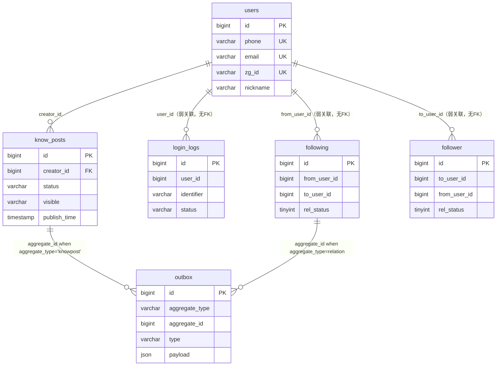
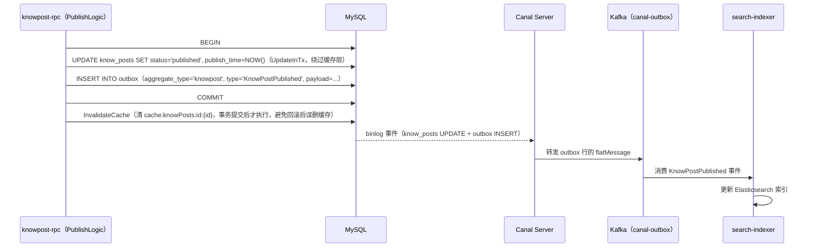

# 数据库表设计

本文档基于 `db/migrations/` 下的迁移脚本以及配套的模型层代码（`services/*/shared/model`、`services/user/rpc/internal/model*`）梳理 zhiguang-go 项目当前的 MySQL 表结构设计。全库统一使用 `ENGINE=InnoDB`、`CHARSET=utf8mb4`、`COLLATE=utf8mb4_unicode_ci`，业务主键普遍采用应用层生成的 **Snowflake ID**（`BIGINT UNSIGNED`，非自增），仅 `users` 表和 `login_logs` 表例外保留了传统的 `AUTO_INCREMENT`。

## 1. 表设计概述

当前共 6 个正式迁移版本，对应 5 张业务表（`users`、`login_logs`、`know_posts`、`outbox`、`following`/`follower`）加 1 条账号权限脚本（`canal` 复制账号，无表结构）。整体设计围绕两条主线展开：**用户身份/内容领域**与**事务性发件箱（Transactional Outbox）驱动的事件分发**。

用户体系以 `users`（用户主档）为核心，`login_logs`（登录审计日志）通过弱关联（无外键，仅索引）记录每次登录尝试。内容领域的 `know_posts`（知文/知识贴）通过 `creator_id` 外键强绑定到 `users`，代表一篇内容从草稿到发布再到删除的完整生命周期。关系领域的 `following`/`follower` 是同一份关注关系的两张镜像表（双写、双向索引），用**反规范化**换查询性能：`following` 以 `from_user_id`（关注者）为主查询维度，`follower` 以 `to_user_id`（被关注者）为主查询维度，避免任一方向的列表查询走扫描。

事件分发不建独立的消息表，而是复用同一张 `outbox` 表（**多聚合根共享**：`know_posts` 和 `following/follower` 的写操作都会在同一事务内插入一行 `outbox` 记录，用 `aggregate_type` 字段区分领域）。`outbox` 本身不被应用直接消费，而是被 **Canal** 监听 MySQL binlog 后转发到 Kafka，再由各领域的下游消费者（`search-indexer`、`relation-syncer` 等）异步处理，形成"业务写入 + outbox 落库"同事务、"下游消费"异步化的解耦模式。`services/outbox/gc` 是这条链路的收尾清道夫，定期把已经过了保留期的 outbox 行删除，防止表无限增长。

`counter`/`usercounter` 领域（点赞/收藏/关注数等计数）**没有对应的 MySQL 表**——从代码检索结果看，其计数状态完全落在 Redis（`pkg/counterlua` 的 Lua 脚本原子操作 + `services/counter/shared/sds` 的打包数据结构），`counter-aggregator`/`counter-reconciler` 是纯 Redis 侧的批量落盘与对账 worker，不涉及独立的关系型持久化表。这是一个刻意的架构选择：高频计数走内存态存储，避免 MySQL 承担高并发写入压力。

## 2. 核心表与字段设计

### 2.1 `users`（用户主档）

```sql
CREATE TABLE IF NOT EXISTS users (
    id BIGINT UNSIGNED NOT NULL AUTO_INCREMENT,
    phone VARCHAR(32) NULL,
    email VARCHAR(128) NULL,
    password_hash VARCHAR(128) NULL,
    nickname VARCHAR(64) NOT NULL,
    avatar TEXT NULL,
    bio VARCHAR(512) NULL,
    zg_id VARCHAR(64) NULL,
    gender VARCHAR(16) NULL,
    birthday DATE NULL,
    school VARCHAR(128) NULL,
    tags_json JSON NULL,
    created_at TIMESTAMP NOT NULL DEFAULT CURRENT_TIMESTAMP,
    updated_at TIMESTAMP NOT NULL DEFAULT CURRENT_TIMESTAMP ON UPDATE CURRENT_TIMESTAMP,
    PRIMARY KEY (id),
    UNIQUE KEY uk_users_phone (phone),
    UNIQUE KEY uk_users_email (email),
    UNIQUE KEY uk_users_zg_id (zg_id)
) ENGINE=InnoDB DEFAULT CHARSET=utf8mb4 COLLATE=utf8mb4_unicode_ci;
```

- `id`（用户主键，`AUTO_INCREMENT` 自增，与其它领域表的 Snowflake ID 生成策略不同——用户体系保留了自增主键这一更早期的设计）。
- `phone` / `email` / `zg_id`（三个可空但各自带唯一索引的登录/展示身份标识；`zg_id` 是平台自定义的"知光号"，供用户名片式展示与搜索）。三者均允许 `NULL` 且共享唯一索引，MySQL 对 `NULL` 值不做唯一性冲突检测，因此同一时刻可以有多个用户三者都为空（例如手机号登录用户没有绑定邮箱）。
- `password_hash`（登录密码的哈希值，从不存明文）。
- `nickname`（展示昵称，`NOT NULL`，无唯一约束，允许重复）。
- `tags_json`（用户兴趣标签，JSON 数组，供个性化推荐/搜索使用）。
- `created_at` / `updated_at`（审计时间戳，`updated_at` 用 `ON UPDATE CURRENT_TIMESTAMP` 自动维护，不需要应用层显式赋值）。

该表是 `know_posts.creator_id` 的外键目标，也是整个系统身份认证（`proto/user.proto` 的 `User`/`Auth` 两个 RPC 服务）的数据根基。

### 2.2 `login_logs`（登录审计日志）

```sql
CREATE TABLE IF NOT EXISTS login_logs (
    id BIGINT UNSIGNED NOT NULL AUTO_INCREMENT,
    user_id BIGINT UNSIGNED NULL,
    identifier VARCHAR(128) NOT NULL,
    channel VARCHAR(32) NOT NULL,
    ip VARCHAR(45) NULL,
    user_agent VARCHAR(512) NULL,
    status VARCHAR(16) NOT NULL,
    created_at TIMESTAMP NOT NULL DEFAULT CURRENT_TIMESTAMP,
    PRIMARY KEY (id),
    KEY ix_login_logs_user_created_at (user_id, created_at)
) ENGINE=InnoDB DEFAULT CHARSET=utf8mb4 COLLATE=utf8mb4_unicode_ci;
```

- `user_id`（登录成功后关联的用户 ID，可为 `NULL`——登录失败场景下可能还未定位到具体用户，例如手机号根本不存在）。**注意：与 `users.id` 之间没有声明外键约束**，是刻意的弱关联设计，允许审计日志独立于用户生命周期存在（即使用户被物理删除，登录日志也不会被级联删除或产生外键错误）。
- `identifier`（登录时用户输入的原始标识，如手机号/邮箱本身，不依赖 `user_id` 是否解析成功都要留痕）。
- `channel`（登录渠道，如短信验证码/密码登录等，具体取值由应用层枚举维护，表结构本身不做约束）。
- `ip` / `user_agent`（访问来源信息，用于风控与异常登录排查）。
- `status`（登录结果状态，如成功/失败，具体取值由应用层枚举维护）。
- 唯一索引 `ix_login_logs_user_created_at (user_id, created_at)`：为"查某用户最近登录记录"这一高频查询设计的复合索引，天然支持按时间倒序分页。

### 2.3 `know_posts`（知文内容表）

```sql
CREATE TABLE IF NOT EXISTS know_posts (
    id BIGINT UNSIGNED NOT NULL,
    tag_id BIGINT UNSIGNED NULL COMMENT '主分类/内容分类ID',
    tags JSON NULL COMMENT '标签名数组，例如 ["java","编程"]',
    title VARCHAR(256) NULL,
    description VARCHAR(50) NULL COMMENT '摘要/描述，最多50字',
    content_url TEXT NULL COMMENT '正文存储于OSS的访问URL或签名URL',
    content_object_key VARCHAR(512) NULL COMMENT 'OSS对象Key',
    content_etag VARCHAR(128) NULL COMMENT 'OSS ETag（用于校验）',
    content_size BIGINT UNSIGNED NULL COMMENT '正文字节大小',
    content_sha256 CHAR(64) NULL COMMENT '正文SHA-256哈希（hex）',
    creator_id BIGINT UNSIGNED NOT NULL,
    is_top TINYINT(1) NOT NULL DEFAULT 0,
    type VARCHAR(32) NOT NULL DEFAULT 'image_text',
    visible VARCHAR(32) NOT NULL DEFAULT 'public',
    img_urls JSON NULL COMMENT '图片URL数组或对象数组',
    video_url TEXT NULL COMMENT '视频URL（一期不使用）',
    status VARCHAR(16) NOT NULL DEFAULT 'draft',
    create_time TIMESTAMP NOT NULL DEFAULT CURRENT_TIMESTAMP,
    update_time TIMESTAMP NOT NULL DEFAULT CURRENT_TIMESTAMP ON UPDATE CURRENT_TIMESTAMP,
    publish_time TIMESTAMP NULL DEFAULT NULL,
    PRIMARY KEY (id),
    KEY ix_know_posts_creator_ct (creator_id, create_time),
    KEY ix_know_posts_status_ct (status, create_time),
    KEY ix_know_posts_tag_ct (tag_id, create_time),
    KEY ix_know_posts_top_ct (is_top, create_time),
    KEY ix_know_posts_creator_status_pub (creator_id, status, publish_time),
    CONSTRAINT fk_know_posts_creator FOREIGN KEY (creator_id) REFERENCES users(id)
) ENGINE=InnoDB DEFAULT CHARSET=utf8mb4 COLLATE=utf8mb4_unicode_ci;
```

这是内容领域最核心也是字段最多的表，设计上把"正文内容"和"元数据"拆开存储：正文本体不落库，只存 OSS 对象引用（`content_url`/`content_object_key`/`content_etag`/`content_size`/`content_sha256`），MySQL 只承载可查询、可索引的结构化元数据，避免大文本拖慢主库。

- `id`（Snowflake 生成的知文 ID，非自增；与用户体系的自增策略不同，说明内容表是后续阶段新设计，直接采用了分布式 ID 方案）。
- `status`（内容生命周期状态机字段，代码中出现的取值为 `draft`（草稿，`createdraftlogic.go` 创建时的默认值）、`published`（已发布，`publishlogic.go` 里由草稿态转换而来）、`deleted`（软删除，`ListMyFeed` 查询显式排除该状态，代表这是逻辑删除而非物理删除）。状态转换的驱动逻辑集中在 `services/knowpost/rpc/internal/logic/knowpost/*.go` 各个 logic 文件，而不是数据库层的约束或触发器。
- `visible`（可见性枚举，代码 `patchmetadatalogic.go` 中显式校验的合法取值为 `public`（公开）、`followers`（仅关注者可见）、`school`（仅同校可见）、`private`（仅自己可见）、`unlisted`（不公开列出但持有链接可访问）。
- `type`（内容形态，默认 `image_text`（图文），`video_url` 字段的注释标注"一期不使用"，说明视频类型在当前迭代只预留了字段，功能未上线）。
- `is_top`（置顶标记，`TINYINT(1)` 作布尔用，配合 `ix_know_posts_top_ct` 索引支撑"置顶内容优先展示"的排序查询）。
- `tag_id` + `tags`（分类设计上是"单一主分类 ID + 自由标签数组"并存：`tag_id` 用于结构化筛选和索引 `ix_know_posts_tag_ct`，`tags` 是 JSON 数组用于展示和全文检索场景，不建索引）。
- `publish_time`（区别于 `create_time`，只有真正执行 `Publish` 动作后才被赋值，`NULL` 代表尚未发布过；`ix_know_posts_creator_status_pub` 复合索引专门服务"某作者已发布内容按发布时间排序"的查询场景）。
- 外键 `fk_know_posts_creator` 强制 `creator_id` 必须指向存在的 `users.id`，与 `login_logs` 的弱关联形成对比——内容归属关系被数据库层强制保证，不允许出现"孤儿内容"。

五个二级索引全部是 `(维度列, 时间列)` 的复合结构（`creator_id`、`status`、`tag_id`、`is_top` 分别配 `create_time`），体现出这张表的核心访问模式是"按某个维度筛选 + 按时间排序分页"，这正是内容流（Feed）类查询的典型形态。`services/knowpost/shared/model/knowpostsmodel.go` 里的 `ListPublicFeed`（公共内容流：`status='published' AND visible='public'`，按 `publish_time DESC`）和 `ListMyFeed`（我的内容流：`status<>'deleted'`，按 `update_time DESC`）两个自定义查询方法直接对应这套索引设计。

值得注意的是，`UpdateInTx`（在外部事务里执行整行覆盖更新，绕过 go-zero 的 `CachedConn` 缓存层）配套了 `InvalidateCache`（清除 `cache:knowPosts:id:{id}` 这个模型级缓存键）。CLAUDE.md 记录的历史 bug 表明：这两者必须成对出现在同一次写操作之后，否则会出现"部分字段更新后被后续覆盖写冲掉"的数据丢失问题——这是表设计之外，缓存一致性层面的强约束，新增写路径时需要遵守。

### 2.4 `following` / `follower`（关注关系镜像表）

```sql
CREATE TABLE IF NOT EXISTS following (
    id BIGINT UNSIGNED NOT NULL,
    from_user_id BIGINT UNSIGNED NOT NULL,
    to_user_id BIGINT UNSIGNED NOT NULL,
    rel_status TINYINT NOT NULL DEFAULT 1,
    created_at DATETIME(3) NOT NULL,
    updated_at DATETIME(3) NOT NULL,
    PRIMARY KEY (id),
    UNIQUE KEY uk_from_to (from_user_id, to_user_id),
    KEY idx_from_created (from_user_id, created_at, to_user_id, rel_status),
    KEY idx_to (to_user_id, from_user_id, rel_status)
) ENGINE=InnoDB DEFAULT CHARSET=utf8mb4 COLLATE=utf8mb4_unicode_ci;

CREATE TABLE IF NOT EXISTS follower (
    id BIGINT UNSIGNED NOT NULL,
    to_user_id BIGINT UNSIGNED NOT NULL,
    from_user_id BIGINT UNSIGNED NOT NULL,
    rel_status TINYINT NOT NULL DEFAULT 1,
    created_at DATETIME(3) NOT NULL,
    updated_at DATETIME(3) NOT NULL,
    PRIMARY KEY (id),
    UNIQUE KEY uk_to_from (to_user_id, from_user_id),
    KEY idx_to_created (to_user_id, created_at, from_user_id, rel_status),
    KEY idx_from (from_user_id, to_user_id, rel_status)
) ENGINE=InnoDB DEFAULT CHARSET=utf8mb4 COLLATE=utf8mb4_unicode_ci;
```

这两张表描述**同一份**关注关系（谁关注了谁），字段几乎镜像对称，是典型的读优化反规范化设计：不建外键（`from_user_id`/`to_user_id` 均未声明 `FOREIGN KEY` 约束到 `users.id`，与 `know_posts` 的强外键形成对比，说明关系表的写入频率和一致性要求让团队选择放弃外键校验以换取性能），一致性完全交给应用层的双写事务来保证。

- `rel_status`（关系状态标记，`TINYINT`，`1` 表示活跃关注中，`0` 表示已取关；取关是**逻辑删除**而不是物理删除该行——`services/relation/shared/model/followingmodel.go` 的 `MarkInactive` 方法只是把 `rel_status` 置 0，并不 `DELETE`）。
- `UpsertActive`（关注动作对应的写操作：`INSERT ... ON DUPLICATE KEY UPDATE rel_status=1`，利用 `uk_from_to`/`uk_to_from` 唯一索引实现"关注→取关→再关注"复用同一行 ID，而不是每次关注都产生新行）。这意味着 `following`/`follower` 表里一对用户之间**永远最多一行**，历史关注/取关的时序变化不留痕，只反映当前状态。
- `following` 表以 `from_user_id`（关注者）打头做唯一索引和主要查询索引，服务"我关注了谁"（`PageActive` 按 `created_at DESC` 分页，支持 offset 分页和 cursor 分页两种模式）；`follower` 表反过来以 `to_user_id`（被关注者）打头，服务"谁关注了我"。这是为避免双向查询都要反查唯一索引的第二列而做的物理表镶像，本质上是用双写换双向查询都能走索引最左前缀。
- `created_at`/`updated_at` 用 `DATETIME(3)`（毫秒精度）而非 `TIMESTAMP`，与其它表不同，且没有 `DEFAULT CURRENT_TIMESTAMP`——时间值完全由应用层用 `NOW(3)` 显式写入（见 `UpsertActive`/`MarkInactive` 的 SQL），不依赖数据库默认值机制。

两张表的写入必须在同一个事务内完成（`UpsertActive`/`MarkInactive` 都接收外部 `sqlx.Session`），并与 `outbox` 表的事件写入捆绑，保证"关注关系落库"与"关注事件产生"具备原子性。

### 2.5 `outbox`（事务性发件箱，跨领域共享）

```sql
CREATE TABLE IF NOT EXISTS outbox (
    id BIGINT UNSIGNED NOT NULL,
    aggregate_type VARCHAR(64) NOT NULL,
    aggregate_id BIGINT UNSIGNED NULL,
    type VARCHAR(64) NOT NULL,
    payload JSON NOT NULL,
    created_at TIMESTAMP(3) NOT NULL DEFAULT CURRENT_TIMESTAMP(3),
    PRIMARY KEY (id),
    KEY ix_outbox_agg (aggregate_type, aggregate_id),
    KEY ix_outbox_ct (created_at)
) ENGINE=InnoDB DEFAULT CHARSET=utf8mb4 COLLATE=utf8mb4_unicode_ci;
```

- `aggregate_type`（聚合根类型，字符串常量，当前代码里出现两个取值：`"knowpost"`（`services/knowpost/shared/event/event.go` 定义的 `AggregateType`）和关系领域写入时使用的对应常量；这是同一张物理表被多个业务领域共用的关键区分字段）。
- `aggregate_id`（该事件所属的业务实体 ID，如某篇知文的 ID 或某条关注关系的 ID；可为 `NULL`，为跨实体的批量事件留了余地，但目前各领域的写入路径均传入具体 ID）。
- `type`（细分事件类型字符串，知文领域为 `KnowPostCreated`/`KnowPostPublished`/`KnowPostUpdated`/`KnowPostDeleted`，关系领域为 `FollowCreated`/`FollowCanceled`；下游消费者按这个字段分发处理逻辑）。
- `payload`（事件体，JSON 类型，序列化规则由各领域自己的 `event.RelationEvent`/知文事件结构体决定，`outbox` 表本身对内容格式不做约束，是典型的"表结构与业务语义解耦"设计）。
- `id`（同样是 Snowflake ID，不与聚合根的 ID 冲突，`InsertInTx` 方法要求调用方显式传入，不依赖自增）。

`ix_outbox_agg (aggregate_type, aggregate_id)` 支持按聚合根反查事件历史（调试/审计场景），`ix_outbox_ct (created_at)` 直接服务于 `outbox-gc` worker 的批量过期清理（`DELETE FROM outbox WHERE created_at < ? ORDER BY id LIMIT ?`，见下文）。

这张表本身**没有"已消费"标记字段**——它不是一个持久化的消息队列，消费状态的追踪完全交给 Canal（监听 binlog 增量，不依赖表内字段判断是否处理过）和 Kafka 的消费组 offset 机制。这意味着 `outbox` 表在数据库层面只承担"写入产生 + 定时清理"两个职责，中间的"是否已被下游处理"这个状态完全在库外维护，`outbox-gc` 因此只能按时间窗口（`RetainDays` 配置项）粗粒度清理，无法感知某一行是否真的已经被所有下游消费完——这是一个需要留意的设计取舍：`RetainDays` 必须设置得比所有下游消费者可能出现的最大消费延迟更长，否则存在"清理了尚未消费的事件"的风险。

### 2.6 `canal` 复制账号（非表结构）

```sql
CREATE USER IF NOT EXISTS 'canal'@'%' IDENTIFIED WITH mysql_native_password BY 'canal';
GRANT SELECT, REPLICATION SLAVE, REPLICATION CLIENT ON *.* TO 'canal'@'%';
FLUSH PRIVILEGES;
```

这条迁移不创建表，而是为 Canal Server 创建专用的低权限复制账号（仅 `SELECT` + 两个 `REPLICATION` 权限，不能写数据），供 canal-server 以 MySQL 从库协议身份拉取 binlog。迁移脚本注释明确标注：这是 dev/集成环境的便利写法，生产环境该账号应由 DBA 人工流程创建，不走 migration 管理——这是一条关于账号权限的运维边界说明，而非表设计本身。

## 3. 表间关系与数据流



一次典型的"发布知文"写路径贯穿了表结构设计的核心思想：



关注/取关的写路径结构相同，区别在于同一个事务要双写 `following` 和 `follower` 两张镶像表（保证两表内容始终一致），并各自触发对应 `outbox` 行，由 `relation-syncer` 消费后维护缓存态的关注列表快照。

## 4. 异常处理与边界设计

- **软删除优先于物理删除**：`know_posts.status='deleted'` 和 `following/follower.rel_status=0` 都是逻辑标记，业务表不做物理 `DELETE`，保留了完整的历史轨迹供审计和"取关后再关注"这类状态复用场景；只有 `outbox` 这张纯事件表会被 `outbox-gc` 物理删除，因为它只是消息中转层，不承担业务状态语义。
- **强弱外键的取舍**：`know_posts.creator_id` 到 `users.id` 有显式外键约束（内容归属不允许悬空），而 `login_logs.user_id`、`following/follower` 到 `users.id` 均无外键（高频写入场景优先性能，接受"用户被删除后残留孤儿记录"的理论风险，需要应用层或定期清理任务兜底，当前代码库未见对应的清理逻辑，是潜在的技术债）。
- **缓存与数据库写入的顺序依赖**：`know_posts` 的自定义 `UpdateInTx` 路径要求调用方必须在事务提交成功后才调用 `InvalidateCache`，且不能放在事务内部（避免回滚场景下缓存被误删导致下次读取直接穿透到还未提交的旧值——实际上代码注释强调的是"避免回滚后缓存态与已提交前的数据库态出现短暂的不一致窗口"）。这个顺序如果颠倒，会复现 CLAUDE.md 记录的"PatchMetadata 后紧跟 ConfirmContent 导致字段被冲回空值"的历史 bug。
- **outbox 清理的时间窗口风险**：`outbox-gc` 只按 `created_at < cutoff` 做批量删除（`ORDER BY id LIMIT batchSize` 分批避免长事务锁表），没有检查该行是否已被下游消费方处理完。如果某个消费者（如 `search-indexer`）长时间离线导致消费延迟超过 `RetainDays`，会出现事件永久丢失且无从查起的风险，这是该表设计里唯一缺乏兜底机制的边界情况，依赖运维层面保证 `RetainDays` 配置值留有足够冗余。
- **唯一索引承担业务幂等**：`following`/`follower` 的 `UpsertActive` 依赖 `uk_from_to`/`uk_to_from` 唯一索引配合 `ON DUPLICATE KEY UPDATE` 实现幂等（重复关注请求不会产生脏数据，只会把 `rel_status` 稳定置 1），是用数据库约束而非应用层加锁/查询判断来兜底并发关注请求的典型设计。
