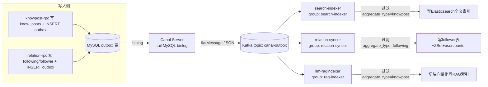
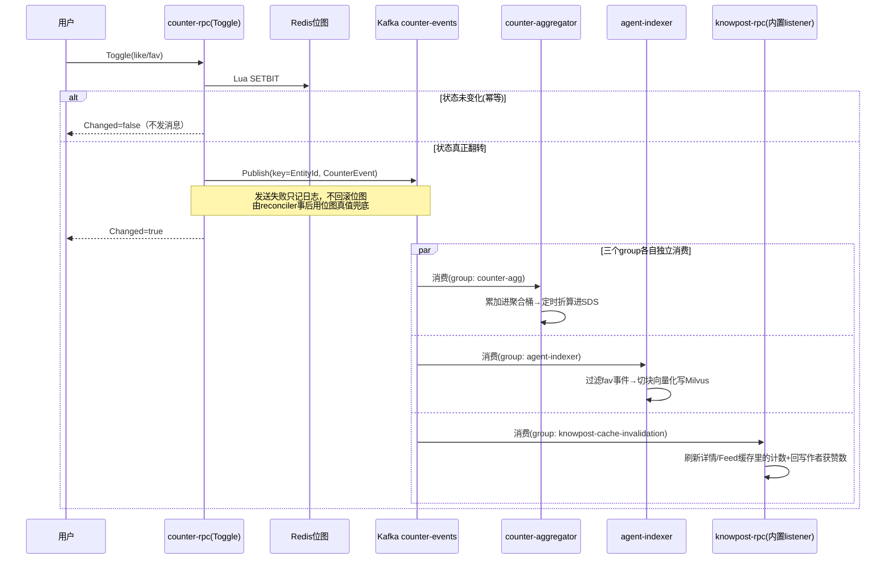

# Kafka 在本项目中的使用方式

## 1. 概述

本项目里 Kafka 不是用来承载"业务系统之间直接互发消息"的通用消息总线,而是扮演两种截然不同的角色:一是作为 **CDC(Change Data Capture)事件的转发管道**——业务服务只管在 MySQL 事务里写一行 `outbox` 记录,由 Canal 监听 binlog 把变更"拍下来"发到 Kafka,应用代码完全不直接往这条链路发消息;二是作为**服务间的轻量级异步通知总线**——比如点赞/收藏这类高频操作,由业务代码直接 `Publish` 一条消息到 Kafka,供其它服务异步响应。这两种用法共用同一套 Kafka 集群和同一套消费者框架(`pkg/kafkax`),但产生消息的方式、消费者的消费模式(全量广播 vs 单一处理)有本质区别,理解这个区分是看懂整张拓扑图的关键。

## 2. Topic 清单

| Topic | 生产方式 | 生产者 | 消息体来源 |
|---|---|---|---|
| `canal-outbox` | Canal Server 监听 MySQL binlog 自动产生,业务代码不直接写 | Canal Server(通过 `canal.mq.topic` 配置) | `outbox` 表的 INSERT/UPDATE 行(flatMessage 格式,含 `know_posts`/`following` 等多个聚合根的事件混在一起) |
| `counter-events` | 业务代码在 RPC 逻辑里主动调 `Producer.Publish` | `counter-rpc` 的 `ToggleLogic`(`services/counter/rpc/internal/logic/counter/togglelogic.go:74`) | 点赞/收藏状态翻转产生的 `CounterEvent`(增量 `Delta:±1`) |

两个 topic 的产生机制完全不同:`canal-outbox` 是 CDC 管道,内容由数据库变更决定,任何写 `outbox` 表的服务(目前是 knowpost-rpc、relation-rpc)都不需要关心 Kafka,只管落库;`counter-events` 是应用代码直接生产的领域事件,发送失败与否由业务代码自己决定要不要在意(counter 域选择了"不回滚、只记日志"这一策略,见后文)。

## 3. 消费者清单

`canal-outbox` 这一个 topic 被三个**独立的 consumer group** 各自完整消费一遍(每个 group 都会拿到全量消息,互不影响进度),这是 Kafka 消费组模型的标准用法——一份数据,多个订阅方各自按自己的节奏处理:

| 消费者进程 | Consumer Group | 关心的 `aggregate_type` | 处理内容 |
|---|---|---|---|
| `search-indexer` | `search-indexer` | `knowpost` | 增删改 Elasticsearch 里的知文全文检索文档 |
| `relation-syncer` | `relation-syncer` | `following` | 补写 `follower` 反查表 + Redis ZSet 关注列表缓存 + usercounter 关注数/粉丝数 |
| `llm-ragindexer`(`rag-indexer` group) | `rag-indexer` | `knowpost` | 知文正文切块、向量化,写入 ES 向量索引(RAG 检索用) |

`counter-events` 这一个 topic 也被多个独立 group 消费,同样是全量广播模式:

| 消费者进程 | Consumer Group | 关心的过滤条件 | 处理内容 |
|---|---|---|---|
| `counter-aggregator` | `counter-agg` | 全部(不按 entityType 过滤) | 把 delta 累加进 Redis 聚合桶,再定时折算进 SDS 计数结构(见 `docs/counter-reconciler.md`) |
| `agent-indexer` | `agent-indexer` | `EntityType=="knowpost" && Metric=="fav"` | 用户收藏知文后,把该知文正文切块向量化写入 Milvus/ES,构建"个人知识库"检索源;取消收藏则反向清理 |
| `knowpost-rpc`(内置的 `listener` 包,不是独立进程) | `knowpost-cache-invalidation` | `EntityType=="knowpost"`,`Metric` 为 `like`/`fav` | 点赞/收藏数变化后,刷新或失效知文详情缓存、公共 Feed 分页缓存里嵌入的计数,以及回写作者的 `likes_received` 到 usercounter |

最后这一条值得特别指出:`knowpost-rpc` 这个 RPC 服务进程本身内嵌了一个 Kafka consumer 协程(`services/knowpost/rpc/internal/listener/invalidation.go` 的 `Run`),不是像 `search-indexer`/`relation-syncer` 那样以独立二进制部署的 worker——这是因为它要处理的是"给已经在内存/Redis 里的缓存做增量修正",跟 knowpost-rpc 主进程共享同一套缓存客户端和数据模型更自然,没有必要拆成独立进程。

## 4. 消费者如何消费 outbox 表:完整链路

`outbox` 表本身从未被任何服务直接查询/订阅,所有下游都是通过 **Canal → Kafka → 消费者** 这条间接路径感知到 outbox 行的产生。完整链路如下:

具体拆解每一跳:

1. **outbox 行如何产生**:业务写操作(如 `PublishLogic.Publish`)在同一个 MySQL 事务里既更新业务表,也 `INSERT` 一行到 `outbox`(字段:`aggregate_type`/`aggregate_id`/`type`/`payload`)。这一步纯粹是数据库写操作,不涉及任何 Kafka 客户端调用——生产 Kafka 消息这件事完全交给了 Canal,业务代码对 Kafka 的存在毫无感知,这正是 Outbox 模式的核心价值:业务写入与事件分发在技术上解耦,不会出现"数据库写成功但 Kafka 发送失败导致状态不一致"的经典分布式事务难题。

2. **Canal 如何把 binlog 变成 Kafka 消息**:Canal Server 以 MySQL 从库协议连接数据库(用专门建的 `canal` 复制账号),持续 tail binlog。`deploy/compose/canal-conf/canal.properties` 配置了 `canal.mq.flatMessage=true`(把 binlog 事件序列化为扁平 JSON,而不是 protobuf)、`canal.mq.topic=canal-outbox`(固定投递到这一个 topic,不区分源表)、`canal.mq.partitionHash=zhiguang.outbox:id`(按 outbox 表的主键 id 做分区哈希,保证同一行事件不会因为分区重试而错乱,但也意味着不同 outbox 行——即使是同一篇知文的连续两次更新——理论上可能落入不同分区,不保证跨行的严格顺序,当前因为 `partitionsNum=1` 是单分区所以实际上全局有序,一旦未来扩分区需要重新评估这一点)。

3. **canalx 包如何解析出 outbox 行**:所有消费者拿到的都是 Canal flatMessage 格式的原始 JSON,里面混杂了 binlog 里可能出现的任意表的变更(虽然当前 Canal instance 配置只订阅了必要的表)。`pkg/canalx/flatmessage.go` 的 `ParseFlat` 先反序列化出通用结构,`pkg/canalx/outbox.go` 的 `ExtractOutboxRows` 再做三层过滤:只认 `table=="outbox"`,只认 `INSERT`/`UPDATE`(`DELETE` 类型直接跳过,因为 outbox 表只会被 `outbox-gc` 物理删除,这类删除事件对下游没有业务意义),跳过 DDL 事件和字段解析失败的行。每个消费者(`search-indexer`/`relation-syncer`/`rag-indexer`)拿到统一的 `OutboxRow`(`Id`/`AggregateType`/`AggregateId`/`Type`/`Payload`)列表后,再各自按 `AggregateType` 二次过滤出自己关心的那部分(`search-indexer`/`rag-indexer` 只处理 `knowpost`,`relation-syncer` 只处理 `following`)。

4. **去重与幂等**:因为 Kafka 是至少一次投递,三个消费者都在处理具体业务逻辑之前,先用 Redis `SETNX`(`dedup:idx:{type}:{outboxId}`/`dedup:rel:{type}:{outboxId}`/`dedup:rag:{type}:{outboxId}`)卡一次,同一个 outbox 行的重复消息会被直接跳过(返回 `nil` 而不是错误,避免触发无意义的重试退避)。这一层去重是`pkg/kafkax`框架之外、每个消费者各自实现的一套相同思路的小组件,而不是框架内置能力。

5. **按事件类型分发**:`Payload` 字段本身是一段 JSON 字符串(Canal 把所有字段值都转成字符串,包括这个本来就是 JSON 的 payload),消费者反序列化出具体的领域事件(`KnowPostEvent`/`RelationEvent`),再按 `Type` 字段(如 `KnowPostPublished`/`KnowPostUpdated`/`KnowPostDeleted`,或 `FollowCreated`/`FollowCanceled`)分发到具体处理函数。值得注意的是三个消费者对同一个 `KnowPostCreated`(草稿创建)事件的处理是一致的——全部忽略,因为草稿不是公开状态,不需要进搜索索引也不需要进 RAG 索引。

6. **失败重试与死信**:`kafkax.RunConsumer` 统一提供了处理失败时的指数退避重试(最多到 30 秒)+ 可选死信队列(`DlqTopic`)。当前各服务的配置文件(`indexer.yaml`/`syncer.yaml`/`ragindexer.yaml`)都没有配置 `DlqTopic` 和 `MaxRetries`,意味着实际运行时是**无限重试**(`MaxRetries=0` 的默认行为)且不会写死信——如果某条消息处理持续失败(比如下游 RPC 一直超时),consumer 会卡在这条消息上反复重试而不会跳过,这是当前配置里一个需要注意的点:好处是不会丢消息,代价是一条"毒丸消息"会阻塞该 consumer group 在这个分区上的后续进度(因为是单分区,等价于阻塞整个 topic 的消费),需要人工介入才能恢复,不是自动降级到跳过处理。

## 5. `counter-events`:另一条不经过 outbox 的 Kafka 链路

与上面 CDC 驱动的链路不同,`counter-events` 是业务代码主动生产的消息,专门用于点赞/收藏这类"高频、允许短暂不一致、不适合走 MySQL 事务"的场景:

这里的分区键选择也值得一提:`Producer.Publish(ctx, topic, key=EntityId, body)` 用**实体 ID**(而不是用户 ID 或随机)做 Kafka 消息的 key,保证同一篇知文的多次点赞/取消点赞事件被分到同一个分区、按发生顺序被消费——这对 `counter-aggregator` 的 `HIncrBy` 累加操作虽然不是严格必需的(累加本身满足交换律,乱序也能得到正确总和),但对 `agent-indexer` 的收藏/取消收藏处理是重要的:如果一个用户先收藏又立刻取消收藏,乱序处理可能导致"取消"先执行、"收藏"后执行,最终状态是错的(残留了本该被删除的向量索引数据)。

## 6. 关于 Reindex/RAG 索引触发方式的一个例外

`knowpost.proto` 定义的 `Reindex` RPC 当前是阶段性 stub(`services/knowpost/rpc/internal/logic/knowpost/reindexlogic.go`),只校验帖子归属不做任何实际动作,意味着**没有"手动触发单篇重新索引"的入口**——所有索引更新(搜索、RAG)完全依赖上述 outbox→Kafka 的被动触发链路。如果需要对已发布知文做批量重建索引(比如 ES mapping 变更后需要全量刷新),目前只能通过写一次性脚本遍历数据库调用各消费者内部的 `upsert` 逻辑,或者重新消费 Kafka 里保留的历史消息,没有现成的管理接口。
